<h1 align="center">Hi there, I'm a developer! 👋</h1>

  Welcome to my GitHub profile. This dashboard is automatically updated every day with my latest activity.

---

<table border="0">
  <tr>
    <td valign="top" width="50%">
      <!-- LEFT COLUMN -->
       
       
       
       
      
    </td>
    <td valign="top" width="50%">
      <!-- RIGHT COLUMN -->
       
       
       
       
       
      
    </td>
  </tr>
</table>

<!-- CLEARFIX TO PREVENT OVERLAPPING -->

---

  These infographics are generated using <a href="https://github.com/lowlighter/metrics">lowlighter/metrics</a>

