<h1 align="center">Hi there, I'm a developer! 👋</h1>

  Welcome to my GitHub profile. This dashboard is automatically updated every day with my latest activity.

---

<!-- ROW 1 -->

<!-- ROW 2 -->

<!-- ROW 3 -->

<!-- ROW 4 -->

<!-- ROW 5 (Website Screenshots) -->

<!-- CLEARFIX TO PREVENT OVERLAPPING -->

---

  These infographics are generated using <a href="https://github.com/lowlighter/metrics">lowlighter/metrics</a>

